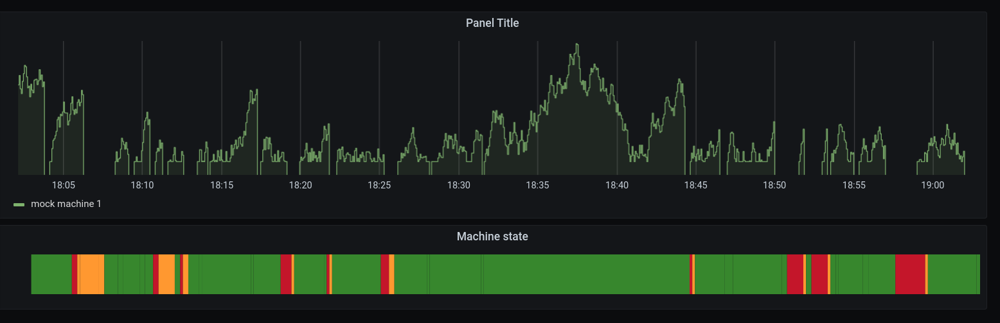
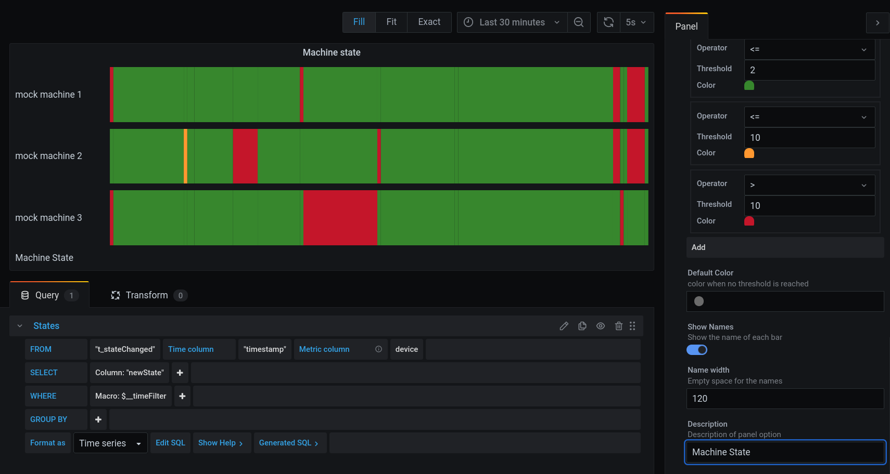

# Status Bar - Grafana Panel Plugin

Do you have a machine or something, that changes the state over time and you wont to see the history?

Check this out!

This panel consumes a serious of numeric value and turn them in to a colorized state bar. The settings are focused on the minimal valuable features. You can define your thresholds and colors very simple with a couple of clicks.

## How to install

### For debugging purposes only

#### Docker

1. Build the project `yarn build`
2. Map `/var/lib/grafana/plugins` as volume to your `dist` folder (e.g. `docker run -d -p 3000:3000 -v "$(pwd)"/dist:/var/lib/grafana/plugins --name=grafana grafana/grafana:latest`)
3. restart grafana after you change something `docker restart grafana`
4. Now this panel should be installed.

#### Local

1. Build the project `yarn build`
1. Copy the contents of `dist` to the `/var/lib/grafana/plugins` folder
1. Restart grafana by using `service grafana-server restart`
1. Now this panel should be installed.

## License

See the LICENSE file for license rights and limitations (Apache License, Version 2.0)
